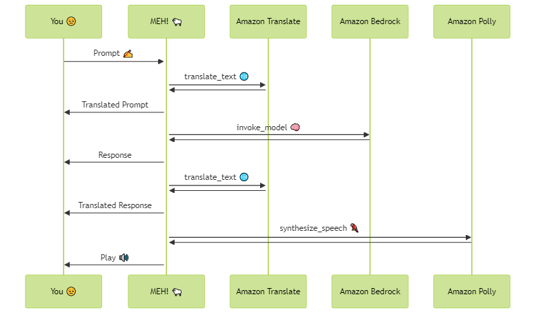

# MEH! 😒🐑 My Expert Helper

## Overview

A simple conversational app powered by LangChain and Streamlit that

1. Takes in a user prompt
2. Translates it to a target language using [Amazon Translate](https://aws.amazon.com/translate/)
3. Sends it to [Anthropic's Claude on Amazon Bedrock](https://aws.amazon.com/bedrock/claude/)
4. Translates the response back to the source language
5. Turns the response into speech via [Amazon Polly](https://aws.amazon.com/polly/)

If this is not enough, here's a sequence diagram telling you the exact same thing:


            
**Why?** Because... meeeeeeeeeeh! 🐑

> **Fun fact:** An earlier version was known as YEAH! (**Y**our **E**xcellent **A**rtificial **H**elper)


## Instructions

### Build

```bash
docker build --rm -t meh .
```

### Deploy

#### Linux

```bash
docker run --rm -e AWS_ACCESS_KEY_ID=$AWS_ACCESS_KEY_ID -e AWS_SECRET_ACCESS_KEY=$AWS_SECRET_ACCESS_KEY -e AWS_SESSION_TOKEN=$AWS_SESSION_TOKEN -e AWS_DEFAULT_REGION=us-east-1 --device /dev/snd -p 8501:8501 meh
```

#### Windows (WSL2)

```bash
wsl docker run --rm -e AWS_ACCESS_KEY_ID=$AWS_ACCESS_KEY_ID -e AWS_SECRET_ACCESS_KEY=$AWS_SECRET_ACCESS_KEY -e AWS_SESSION_TOKEN=$AWS_SESSION_TOKEN -e AWS_DEFAULT_REGION=us-east-1 -e PULSE_SERVER=/mnt/wslg/PulseServer -v /mnt/wslg/:/mnt/wslg/ -p 8501:8501 meh
```